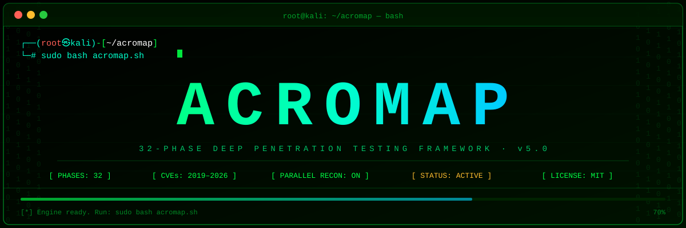

<div align="center">



**ACROMAP v5.0 — 32-Phase Hardened Penetration Testing Framework**

[](https://www.kali.org/)
[](https://www.gnu.org/software/bash/)
[](https://github.com/acro777x/acromap/releases)
[](LICENSE)
[](https://cve.mitre.org/)
[](#legal-disclaimer)

*Built for penetration testers who demand mathematical certainty and WAF-resilient results.*

</div>

---

## 📖 Table of Contents

- [Overview](#-overview)
- [What's New in v5.0](#-whats-new-in-v50)
- [Features](#-features)
- [Hardened Architecture Stack](#-hardened-architecture-stack)
- [32-Phase Architecture](#-32-phase-architecture)
- [Requirements](#-requirements)
- [Installation](#-installation)
- [Usage](#-usage)
- [Scan Profiles](#-scan-profiles)
- [Output Structure](#-output-structure)
- [Vulnerability Severity Levels](#-vulnerability-severity-levels)
- [Legal Disclaimer](#-legal-disclaimer)
- [Author](#-author)

---

## 🔍 Overview

**ACROMAP v5.0** is a fully automated, root-level penetration testing framework. It chains **32 sequential phases** — from passive OSINT through active exploitation simulation, cloud auditing, and Active Directory deep dives — into a single command.

The **Hardened Edition** replaces legacy heuristic "grepping" with **Aristotelian Logic Proofs**, ensuring that every finding is behaviorally confirmed and every sensor failure (WAF interference) is explicitly documented.

---

## 🆕 What's New in v5.0 (Hardened)

### 🛡️ Aristotelian "Explicit State Degradation"
Legacy scanners fail silently when blinded by a WAF. ACROMAP v5.0 introduces **Sensor Layer Degradation**. Our new Python engines detect when a WAF has injected garbage into scan results and explicitly signal the dispatcher. **The state becomes `UNKNOWN`, never "Secure by Error."**

### 📐 Arithmetic Hardening (The 10#0 Paradigm)
Eliminated all bash-arithmetic crashes. Every calculation now uses base-10 forced evaluation, ensuring immunity to octal collisions (e.g., `08`, `09`) and malformed tool outputs.

### 🧬 Deterministic Behavioral Proofing
Vulnerabilities are now confirmed via active loops:
- **Differential Boolean Analysis:** (SQLi) Comparing Baseline vs True vs False responses.
- **Safe Execution Loops:** (Webshells) Reflecting unique MD5-hashed tokens.
- **Asynchronous OOB Polling:** (SSRF) Centralized polling window for DNS/LDAP callbacks.

### 🌀 UI & Speed Enhancements
- **Parallel Recon Engine:** Phases 1–3 run simultaneously.
- **Live Braille Spinner:** Animated progress indicator (`⠋ ⠙ ⠹`) with elapsed time.
- **Cyber-Noir Display:** Rich terminal UI showing live **Critical/High** counts.

---

## ✨ Features

| Feature | Description |
|---|---|
| 📐 **10#0 Paradigm** | Framework-wide mathematical stability; no more bash arithmetic crashes. |
| 🛡️ **Explicit Degradation** | Detects WAF-poisoned results and warns the user instead of failing silently. |
| ⚡ **Parallel Recon** | Phases 1–3 run simultaneously — OSINT, DNS, Subdomains in parallel. |
| 🌀 **Live Braille Spinner** | Animated progress indicator on every tool run with elapsed time. |
| 🎯 **3 Scan Profiles** | `quick` / `standard` / `deep` with per-phase timeout tuning. |
| 💾 **Checkpoint & Resume** | Interrupted scans resume from the last completed phase. |
| 🕵️ **Zero-Day Detection** | Heuristic pattern matching for zero-day exploit surfaces. |
| 🧪 **QA Test Harness** | Built-in 13-assertion integrity suite to verify local installation logic. |
| 📡 **OOB Testing** | Interactsh integration for blind SSRF and OOB callback detection. |
| 🔑 **Secrets Detection** | TruffleHog + gitleaks for supply chain and secrets exposure. |

---

## 🏗️ The Hardened Architecture Stack

1.  **Memory-Resident State Engine:** Zero-disk state transfer via a secure memory bridge.
2.  **Structured Data Engines:** Deterministic XML/JSON parsing for Nmap and WhatWeb.
3.  **Behavioral Proofing:** Confirms vulnerabilities via active verification loops.
4.  **Arithmetic Hardening:** Immunity to octal collisions and null-variable crashes.
5.  **OOB Verification:** Centralized asynchronous polling for DNS/LDAP callbacks.

---

## 🗂️ 32-Phase Architecture

```
Phase 00 ── Setup & Tool Verification
Phase 01 ── Passive OSINT Reconnaissance          ┐
Phase 02 ── DNS Enumeration & Zone Transfer       ├─ Parallelized
Phase 03 ── Subdomain Enumeration (Deep)          ┘
Phase 04 ── Network Discovery & Host Detection
Phase 05 ── Full TCP Port Scanning
Phase 06 ── UDP Port Scanning
Phase 07 ── Service Detection & Banner Grabbing
Phase 08 ── Web Discovery & HTTP Probing
Phase 09 ── Web Technology Fingerprinting
Phase 10 ── SSL/TLS Deep Analysis
Phase 11 ── Web Content Discovery & Fuzzing
Phase 12 ── CMS Detection & Deep Scanning
Phase 13 ── API Endpoint Discovery
Phase 14 ── Nuclei Full Vulnerability Scan
Phase 15 ── Network Service Enumeration
Phase 16 ── SMB & Active Directory Enumeration
Phase 17 ── Authentication & Credential Testing
Phase 18 ── SQL Injection Deep Testing (Behavioral Proof)
Phase 19 ── XSS & Client-Side Attack Vectors (OOB Proof)
Phase 20 ── CVE Targeted Checks (2019–2026)
Phase 21 ── Post-Exploitation Simulation
Phase 22 ── Attack Path & Lateral Movement Analysis
Phase 23 ── Report Generation
Phase 24–31 ── Cloud, K8s, Secrets, AD Deep, and Zero-Day Detection
```

---

## 📋 Requirements

- **Operating System:** Kali Linux (Primary) / Debian / Ubuntu
- **Root Privileges:** Required (auto-escalates via `sudo` or `su`)
- **Python Runtime:** `python3` (Required for hardened sensor layer)
- **Tools:** `jq`, `anew`, `nmap`, `nuclei`, `curl`, `parallel`, `interactsh-client`

---

## 🔧 Installation

```bash
git clone https://github.com/acro777x/acromap.git
cd acromap
chmod +x acromap.sh
```

---

## 🚀 Usage

### 1. Pre-Flight Calibration (Mandatory)
```bash
sudo ./preflight.sh <target>
```

### 2. Integrity Check
```bash
bash qa_harness.sh
```

### 3. Execute Scan
```bash
sudo bash acromap.sh <target>
```

---

## ⚡ Scan Profiles

| Profile | Timeout Depth | Best For | Approx Duration |
|---------|--------------|----------|----------------|
| `quick` | Short | Initial triage, fast surface scan | ~15–30 min |
| `standard` | Balanced | Default, most engagements | ~1–3 hours |
| `deep` | Extended | Full assessment, bug bounty, red team | ~4–8+ hours |

---

## 📂 Output Structure

```
acromap_repo/
├── acromap.sh           # Main Hardened Engine
├── preflight.sh         # Memory Bridge & Calibration
├── nmap_parser.py       # XML Structured Sensor
├── web_parser.py        # JSON Structured Sensor
├── qa_harness.sh        # Aristotelian Integrity Suite
└── README.md            # Hardened Documentation
```

---

## 🚨 Vulnerability Severity Levels

| Severity | Colour | Description |
|----------|--------|-------------|
| 🟣 `ZERO_DAY` | Blinking Magenta | Unpatched / zero-day pattern detected |
| 🔴 `ONE_CLICK` | Underline Red | Single-action exploitable (e.g. takeover, RCE) |
| 🔴 `CRITICAL` | Red | Immediate exploitation risk |
| 🟠 `HIGH` | Orange | High-impact, readily exploitable |
| 🟡 `MEDIUM` | Yellow | Moderate risk, requires chaining |
| 🔵 `LOW` | Cyan | Low severity / defence-in-depth gap |

---

## ⚖️ Legal Disclaimer

This tool is intended **solely** for authorized penetration testing on systems you **own or have explicit written permission** to test. Unauthorized use is illegal under the Computer Fraud and Abuse Act (CFAA) and equivalent laws worldwide. The author bears **no responsibility** for illegal or malicious use.

---

## 👤 Author

**acro777x**  
GitHub: [https://github.com/acro777x](https://github.com/acro777x)

---

<div align="center">

*ACROMAP v5.0 — Scan smarter. Prove it.*

</div>
